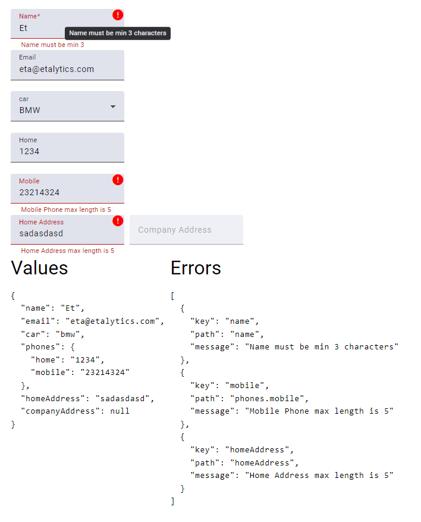

# DynamicFormBuilder

DynamicFormBuilder is a powerful tool that allows the creation of Angular reactive forms using JSON input. This project leverages Angular 18.1 and Angular Material 18.1 to provide a flexible and dynamic way to generate forms in your Angular applications.

## Features

- **Dynamic Form Creation**: Generate reactive forms dynamically based on JSON configuration.
- **Angular Material Integration**: Utilize Angular Material components for a modern and consistent UI.
- **Highly Customizable**: Easily customize form fields, validations, and layout through JSON.
- **Reactive Forms**: Benefit from the power of Angular's reactive forms for robust form management and validation.

## Missing Parts

- Form arrays and fields are not yet supported. Please test them before use and adjust the code as needed.
- Async validations are not supported.

## Example

